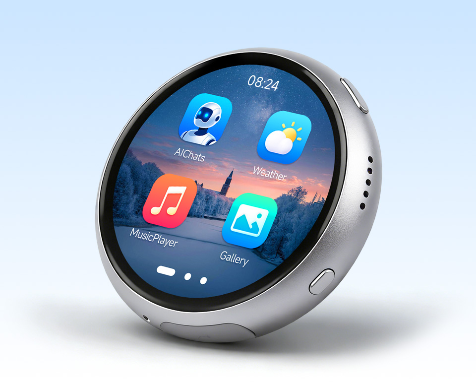

  <h1>ESP32-S3-Touch-AMOLED-1.75C</h1>
  
<strong>ESP32-S3 1.75 英寸 466 × 466 QSPI AMOLED 触控开发板</strong>

  
<a href="README.md">English</a> | <strong>简体中文</strong>

  

    
    
    
  

  

    <a href="https://www.waveshare.com/esp32-s3-touch-amoled-1.75c.htm">🌐 产品</a> &middot;
    <a href="https://github.com/waveshareteam/ESP32-S3-Touch-AMOLED-1.75C/releases/latest">📦 固件</a> &middot;
    <a href="02_Example/ESP-IDF-v5.5.5/">🧩 ESP-IDF</a> &middot;
    <a href="02_Example/Arduino-v3.3.10/">🔧 Arduino</a> &middot;
    <a href="docs/">📚 文档</a>
  

  

---

## ✨ 概述

本仓库提供 Waveshare ESP32-S3-Touch-AMOLED-1.75C 的示例软件、由 CI
构建的可烧录固件包、工厂恢复固件、原理图以及维护者文档。

该开发板采用 ESP32-S3，集成小尺寸方形 AMOLED 显示屏、电容触摸、运动传感器、
电源管理和音频接口，适用于可穿戴形态的应用开发。

## 🖥️ 硬件概览

| 功能 | 器件或接口 |
| --- | --- |
| MCU | ESP32-S3 |
| 显示 | 1.75 英寸 466 × 466 QSPI AMOLED，CO5300 控制器 |
| 触摸 | CST9217 电容触摸控制器，I2C 接口 |
| 电源管理 | AXP2101 |
| 运动传感器 | QMI8658 六轴 IMU |
| 音频 | ES7210 ADC 双数字麦克风；ES8311 音频编解码器 |
| 板级支持 | 托管组件 `waveshare/esp32_s3_touch_amoled_1_75c`（`^3.0.0`） |
| 硬件文件 | [原理图](resource/原理图/) |

## 📦 固件版本

体验示例最快的方法是使用[最新版本](https://github.com/waveshareteam/ESP32-S3-Touch-AMOLED-1.75C/releases/latest)
中已经打包好的可烧录固件。

1. 下载所需示例和框架版本对应的 `*-combined.zip`。
2. 解压后通过 `python -m pip install esptool` 安装 esptool。
3. 通过 USB 连接开发板。
4. Windows 运行 `flash_combined.bat COMx`，Linux 运行
   `./flash_combined.sh /dev/ttyACM0`。
5. 如果开发板未自动重启，请手动复位。

> [!NOTE]
> 合并镜像从偏移地址 `0x0` 烧录。每个固件包还包含原始分段二进制、烧录参数、
> 辅助脚本和校验和。

[`03_Firmware/`](03_Firmware/) 中的工厂恢复镜像与 CI 生成的示例固件相互独立。
详见[固件产物](docs/firmware_ZH.md)。

## 🧪 示例

### ESP-IDF

| 示例 | 主要功能 |
| --- | --- |
| [01_AXP2101](02_Example/ESP-IDF-v5.5.5/01_AXP2101/) | 电源管理和电池遥测 |
| [02_lvgl_demo_v9](02_Example/ESP-IDF-v5.5.5/02_lvgl_demo_v9/) | LVGL 9 显示演示 |
| [03_esp-brookesia](02_Example/ESP-IDF-v5.5.5/03_esp-brookesia/) | ESP-Brookesia 应用界面 |
| [04_Immersive_block](02_Example/ESP-IDF-v5.5.5/04_Immersive_block/README_ZH.md) | 由运动传感器驱动的 LVGL 图形演示 |
| [05_Spec_Analyzer](02_Example/ESP-IDF-v5.5.5/05_Spec_Analyzer/) | 麦克风频谱分析器 |

### Arduino

| 示例 | 主要功能 |
| --- | --- |
| [01_HelloWorld](02_Example/Arduino-v3.3.10/01_HelloWorld/) | 显示初始化 |
| [02_GFX_AsciiTable](02_Example/Arduino-v3.3.10/02_GFX_AsciiTable/) | GFX 文本和字符渲染 |
| [03_LVGL_AXP2101_ADC_Data](02_Example/Arduino-v3.3.10/03_LVGL_AXP2101_ADC_Data/) | LVGL 电源遥测界面 |
| [04_LVGL_QMI8658_ui](02_Example/Arduino-v3.3.10/04_LVGL_QMI8658_ui/) | LVGL IMU 数据界面 |
| [05_LVGL_Widgets](02_Example/Arduino-v3.3.10/05_LVGL_Widgets/) | LVGL 控件、触摸输入和显示交互 |
| [06_ES7210](02_Example/Arduino-v3.3.10/06_ES7210/) | ES7210 麦克风输入 |
| [07_ES8311](02_Example/Arduino-v3.3.10/07_ES8311/) | ES8311 音频输出 |

Arduino 随仓库提供的库位于 [`01_Arduino_Libraries`](01_Arduino_Libraries/)。
其中的上游库示例不会进入本产品的 CI 矩阵。

## 🛠️ 支持的工具链

| 开发框架 | 版本 | 固件构建数 |
| --- | --- | ---: |
| ESP-IDF 源码目录 | `v5.5.5` | 5 |
| Arduino 源码目录 | `3.3.10` | 7 |
| Release `v1.0.1`，ESP-IDF | `v5.5.4` | 5 |
| Release `v1.0.1`，ESP-IDF | `v6.0.2` | 5 |
| Release `v1.0.1`，Arduino-ESP32 | `3.3.10` | 7 |

[示例构建工作流](https://github.com/waveshareteam/ESP32-S3-Touch-AMOLED-1.75C/actions/workflows/examples.yml)
先运行轻量策略检查和两个发现任务，再按变更范围运行最多 17 个固件构建任务。
每个成功构建都会打包为可烧录的合并固件。矩阵和手动触发方式见
[持续集成](docs/ci_ZH.md)。

## 🗂️ 仓库结构

| 路径 | 用途 |
| --- | --- |
| [`02_Example/ESP-IDF-v5.5.5/`](02_Example/ESP-IDF-v5.5.5/) | 第一方 ESP-IDF 工程 |
| [`02_Example/Arduino-v3.3.10/`](02_Example/Arduino-v3.3.10/) | 第一方 Arduino 草图 |
| [`01_Arduino_Libraries/`](01_Arduino_Libraries/) | 随仓库提供的 Arduino 库 |
| [`03_Firmware/`](03_Firmware/) | 工厂、CI 发布和 XiaoZhi 固件 |
| [`04_Community/`](04_Community/) | 资料页链接的社区项目 |
| [`resource/`](resource/) | 硬件资料、网页快照和媒体 |
| [`releases/`](releases/) | 打包、产物下载和发布工具 |
| [`Schematic/`](Schematic/) | 公开原理图文件 |
| [`config/`](config/) | 共用 ESP-IDF 配置覆盖项 |
| [`docs/`](docs/) | 仓库、CI、组件和固件说明 |

## 📚 文档

- [仓库结构](docs/repository-structure_ZH.md)
- [持续集成](docs/ci_ZH.md)
- [组件](docs/components_ZH.md)
- [固件产物](docs/firmware_ZH.md)
- [ESP-Brookesia 说明](docs/brookesia_ZH.md)
- [发布工具](releases/README_ZH.md)
- [已下载资料索引](resource/资料索引.md)

## 🤝 支持与贡献

欢迎提交贡献和可复现的问题报告。请提供示例路径、框架版本、复现步骤、预期行为、
实际行为和相关串口日志。

- [贡献指南](CONTRIBUTING_ZH.md)
- [支持](SUPPORT_ZH.md)
- [安全策略](SECURITY_ZH.md)
- [提交问题](https://github.com/waveshareteam/ESP32-S3-Touch-AMOLED-1.75C/issues/new/choose)

## 📄 许可证

本仓库采用 Apache License 2.0，详见 [LICENSE](LICENSE)。
